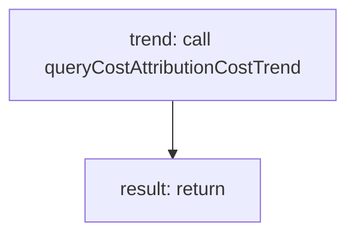

<!-- @generated by flusk-lang — DO NOT EDIT -->

# getCostTrend

> Get daily cost trend for a specific tag over a time period

## Inputs

| Parameter | Type | Required |
|-----------|------|----------|
| dimension | string | yes |
| value | string | yes |
| from | string | yes |
| to | string | yes |
| db | Database | yes |

## Steps

## Output

Type: `CostTrendPoint[]`
