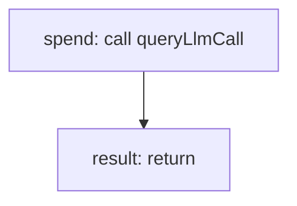

<!-- @generated by flusk-lang — DO NOT EDIT -->

# getDailySpend

> Get total spending for the current day

## Inputs

| Parameter | Type | Required |
|-----------|------|----------|
| db | Database | yes |
| day | string | yes |

## Steps

## Output

Type: `SpendSummary`
