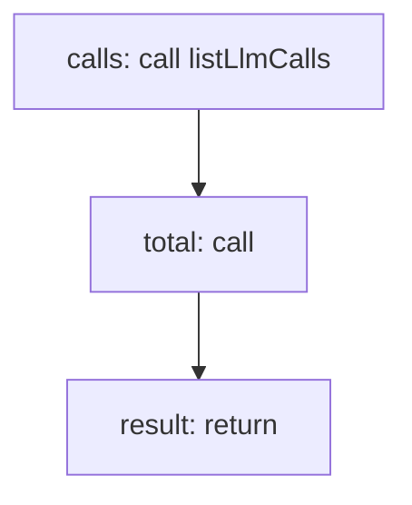

<!-- @generated by flusk-lang — DO NOT EDIT -->

# getMonthlySpend

> Get total spending for the current month

## Inputs

| Parameter | Type | Required |
|-----------|------|----------|
| db | Database | yes |

## Steps

## Output

Type: `SpendSummary`
