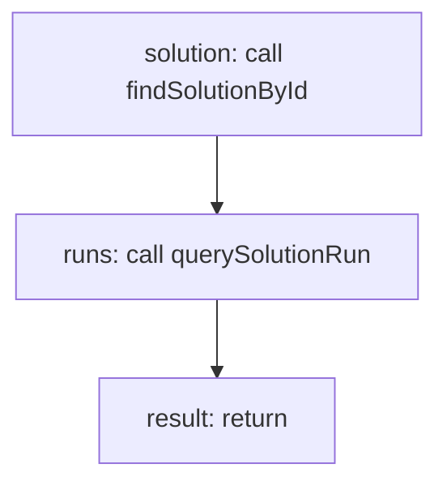

<!-- @generated by flusk-lang — DO NOT EDIT -->

# getSolutionMetrics

> Get solution metrics — cost, latency, success rate, usage over time

## Inputs

| Parameter | Type | Required |
|-----------|------|----------|
| solutionId | string | yes |
| from | string | yes |
| to | string | yes |
| db | Database | yes |

## Steps

## Output

Type: `json`
