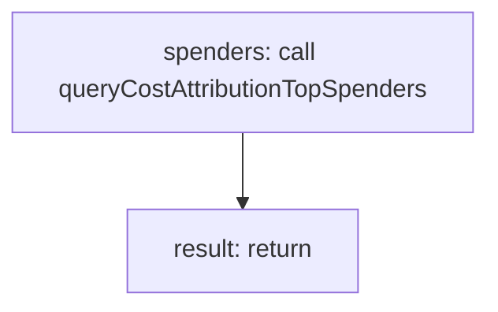

<!-- @generated by flusk-lang — DO NOT EDIT -->

# getTopSpenders

> Get top spenders in a dimension (e.g. top 10 customers by cost)

## Inputs

| Parameter | Type | Required |
|-----------|------|----------|
| dimension | string | yes |
| from | string | yes |
| to | string | yes |
| limit | number | yes |
| db | Database | yes |

## Steps

## Output

Type: `TopSpender[]`
