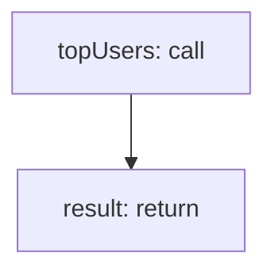

<!-- @generated by flusk-lang — DO NOT EDIT -->

# getTopUsers

> Get top N users by cost or call count

## Inputs

| Parameter | Type | Required |
|-----------|------|----------|
| organizationId | uuid | yes |
| start | string | yes |
| end | string | yes |
| limit | integer | yes |
| sortBy | string | yes |

## Steps

## Output

Type: `json`
