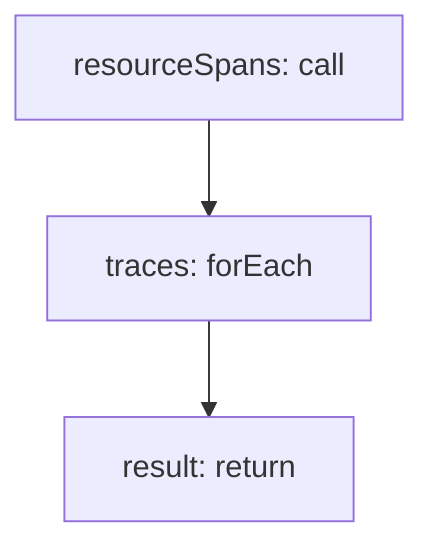

<!-- @generated by flusk-lang — DO NOT EDIT -->

# ingestOtlpTraces

> Receive and parse OTLP trace data into traces and spans

## Inputs

| Parameter | Type | Required |
|-----------|------|----------|
| db | Database | yes |
| otlpPayload | json | yes |

## Steps

## Output

Type: `IngestResult`
