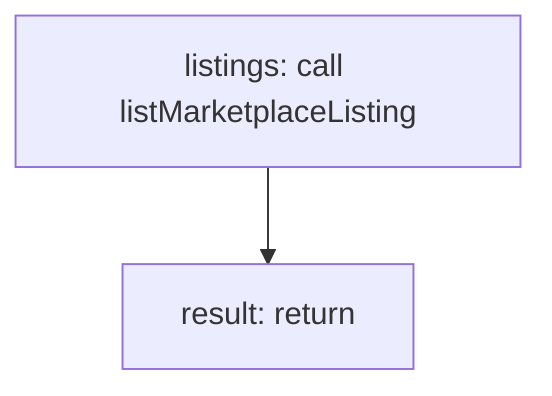

<!-- @generated by flusk-lang — DO NOT EDIT -->

# listMarketplace

> List public marketplace listings with search and filter

## Inputs

| Parameter | Type | Required |
|-----------|------|----------|
| category | string | yes |
| query | string | yes |
| db | Database | yes |

## Steps

## Output

Type: `MarketplaceListing[]`
