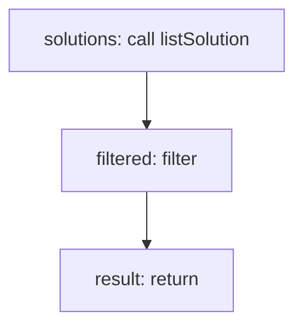

<!-- @generated by flusk-lang — DO NOT EDIT -->

# listSolutions

> List solutions by organization with filters

## Inputs

| Parameter | Type | Required |
|-----------|------|----------|
| organizationId | string | yes |
| status | string | yes |
| type | string | yes |
| db | Database | yes |

## Steps

## Output

Type: `Solution[]`
