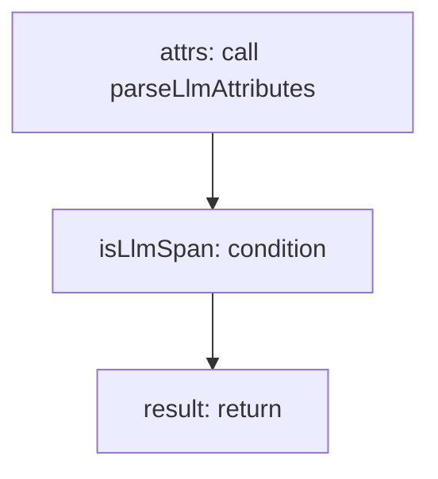

<!-- @generated by flusk-lang — DO NOT EDIT -->

# mapSpanToLlmCall

> Extract LLM call data from an OpenTelemetry span

## Inputs

| Parameter | Type | Required |
|-----------|------|----------|
| db | Database | yes |
| span | json | yes |
| serviceName | string | yes |

## Steps

## Output

Type: `LlmCall`
