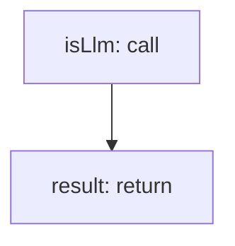

<!-- @generated by flusk-lang — DO NOT EDIT -->

# parseLlmAttributes

> Parse LLM-specific attributes from OpenTelemetry span attributes

## Inputs

| Parameter | Type | Required |
|-----------|------|----------|
| attributes | json | yes |

## Steps

## Output

Type: `LlmAttributes`
