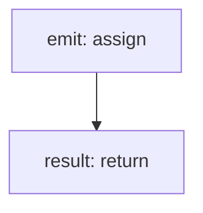

<!-- @generated by flusk-lang — DO NOT EDIT -->

# publishEvent

> Publish an event to the event bus

## Inputs

| Parameter | Type | Required |
|-----------|------|----------|
| event | string | yes |
| payload | json | yes |

## Steps

## Output

Type: `boolean`
