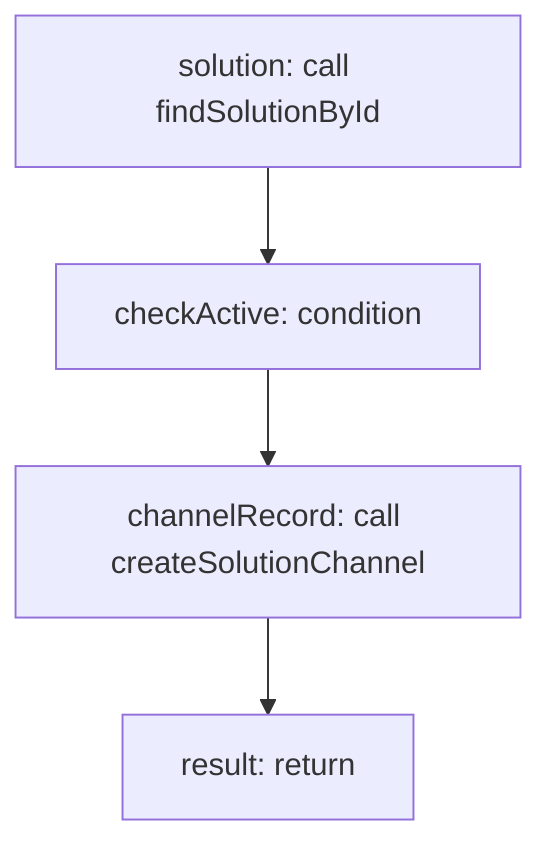

<!-- @generated by flusk-lang — DO NOT EDIT -->

# publishToChannel

> Connects a solution to a messaging channel

## Inputs

| Parameter | Type | Required |
|-----------|------|----------|
| solutionId | string | yes |
| channel | string | yes |
| config | json | yes |
| db | Database | yes |

## Steps

## Output

Type: `SolutionChannel`
