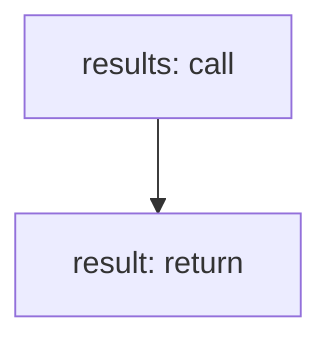

<!-- @generated by flusk-lang — DO NOT EDIT -->

# queryCostAttributionCostByTagAndModel

> Query cost breakdown by tag and model

## Inputs

| Parameter | Type | Required |
|-----------|------|----------|
| tagKey | string | yes |
| tagValue | string | yes |
| from | string | yes |
| to | string | yes |
| db | Database | yes |

## Steps

## Output

Type: `CostByModel[]`
