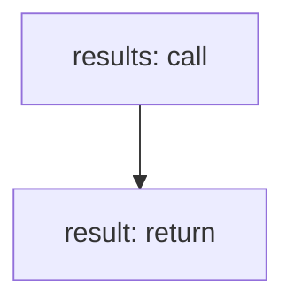

<!-- @generated by flusk-lang — DO NOT EDIT -->

# queryCostAttributionTopSpenders

> Query top spenders in a specific cost dimension

## Inputs

| Parameter | Type | Required |
|-----------|------|----------|
| tagKey | string | yes |
| from | string | yes |
| to | string | yes |
| limit | number | yes |
| db | Database | yes |

## Steps

## Output

Type: `TopSpender[]`
