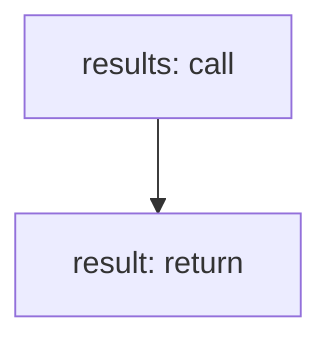

<!-- @generated by flusk-lang — DO NOT EDIT -->

# queryLlmCall

> Query LLM calls with flexible filters (time range, model, status)

## Inputs

| Parameter | Type | Required |
|-----------|------|----------|
| filters | json | yes |
| db | Database | yes |

## Steps

## Output

Type: `LlmCall[]`
