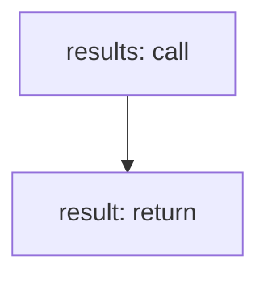

<!-- @generated by flusk-lang — DO NOT EDIT -->

# queryModelPerformance

> Query model performance metrics with filters

## Inputs

| Parameter | Type | Required |
|-----------|------|----------|
| filters | json | yes |
| db | Database | yes |

## Steps

## Output

Type: `ModelPerformance[]`
