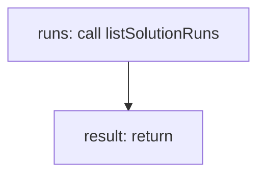

<!-- @generated by flusk-lang — DO NOT EDIT -->

# querySolutionRun

> Query solution runs with aggregations

## Inputs

| Parameter | Type | Required |
|-----------|------|----------|
| solutionId | string | yes |
| db | Database | yes |

## Steps

## Output

Type: `json`
