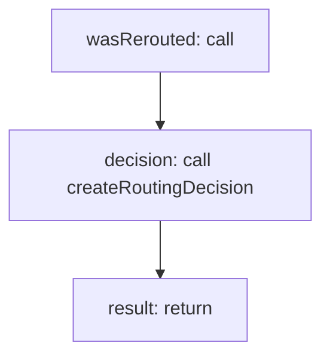

<!-- @generated by flusk-lang — DO NOT EDIT -->

# recordRoutingDecision

> Log a routing decision and calculate savings

## Inputs

| Parameter | Type | Required |
|-----------|------|----------|
| db | Database | yes |
| routingRuleId | string | yes |
| promptCategory | string | yes |
| requestedModel | string | yes |
| selectedModel | string | yes |

## Steps

## Output

Type: `RoutingDecision`
