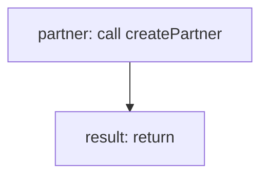

<!-- @generated by flusk-lang — DO NOT EDIT -->

# registerPartner

> Registers a new partner with pending status

## Inputs

| Parameter | Type | Required |
|-----------|------|----------|
| name | string | yes |
| email | string | yes |
| website | string | yes |
| organizationId | string | yes |
| db | Database | yes |

## Steps

## Output

Type: `Partner`
