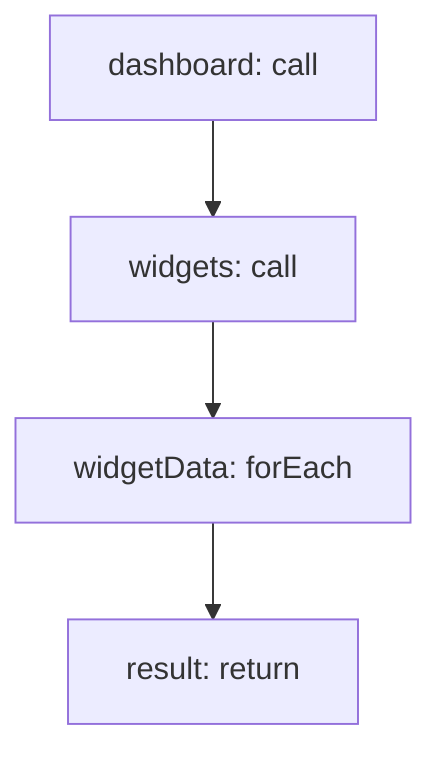

<!-- @generated by flusk-lang — DO NOT EDIT -->

# renderDashboardData

> Fetch data for all widgets in a dashboard

## Inputs

| Parameter | Type | Required |
|-----------|------|----------|
| dashboardId | string | yes |
| timeRange | json | yes |

## Steps

## Output

Type: `DashboardRenderResult`
