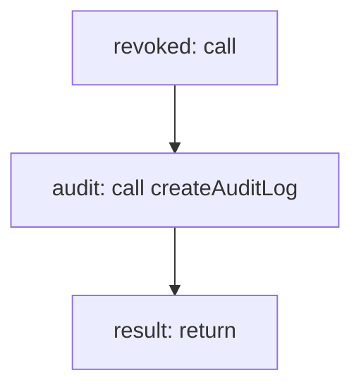

<!-- @generated by flusk-lang — DO NOT EDIT -->

# revokeApiKey

> Revoke an API key by setting its status to revoked

## Inputs

| Parameter | Type | Required |
|-----------|------|----------|
| id | uuid | yes |
| organizationId | uuid | yes |
| userId | uuid | yes |

## Steps

## Output

Type: `ApiKey`
