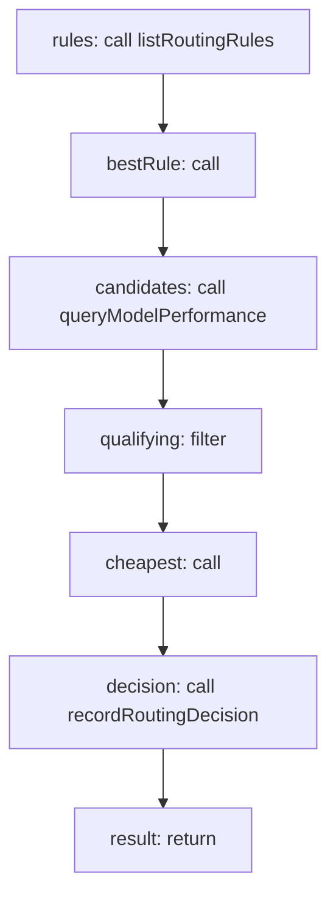

<!-- @generated by flusk-lang — DO NOT EDIT -->

# routeModel

> Select the cheapest qualifying model for a prompt category

## Inputs

| Parameter | Type | Required |
|-----------|------|----------|
| db | Database | yes |
| promptCategory | string | yes |
| requestedModel | string | yes |

## Steps

## Output

Type: `RoutingResult`
