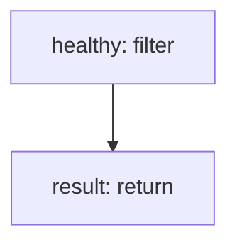

<!-- @generated by flusk-lang — DO NOT EDIT -->

# routeRequest

> Pick the best provider target based on routing strategy

## Inputs

| Parameter | Type | Required |
|-----------|------|----------|
| strategy | string | yes |
| targets | json | yes |
| healthMap | json | yes |

## Steps

## Output

Type: `json`
