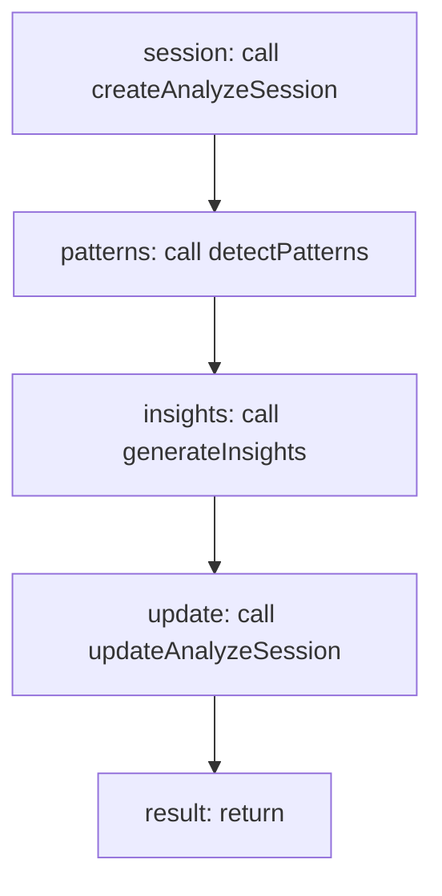

<!-- @generated by flusk-lang — DO NOT EDIT -->

# runAnalysis

> Full analysis pipeline — ingest calls, detect patterns, generate insights

## Inputs

| Parameter | Type | Required |
|-----------|------|----------|
| db | Database | yes |
| scriptPath | string | yes |
| start | string | yes |
| end | string | yes |

## Steps

## Output

Type: `AnalyzeSession`
