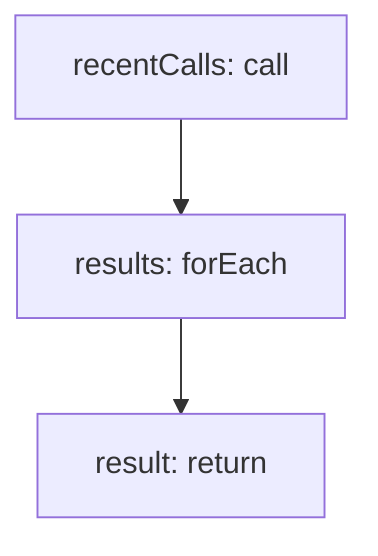

<!-- @generated by flusk-lang — DO NOT EDIT -->

# runDelusionScan

> Orchestrate all delusion checks on recent LLM calls

## Inputs

| Parameter | Type | Required |
|-----------|------|----------|
| agentLabel | string | yes |
| timeRange | json | yes |

## Steps

## Output

Type: `json`
