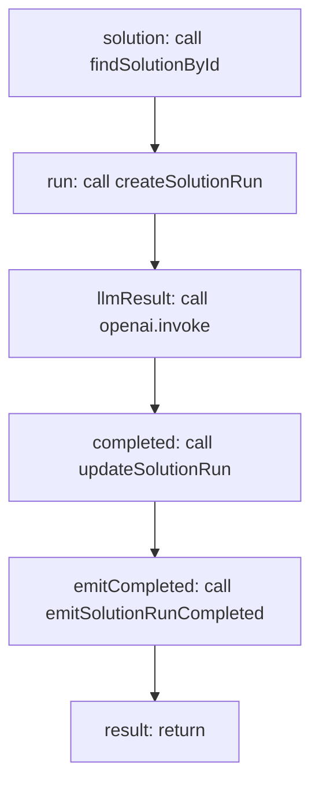

<!-- @generated by flusk-lang — DO NOT EDIT -->

# runSolution

> Executes a solution — loads config, calls LLM, tracks run, emits events

## Inputs

| Parameter | Type | Required |
|-----------|------|----------|
| solutionId | string | yes |
| organizationId | string | yes |
| input | json | yes |
| db | Database | yes |

## Steps

## Output

Type: `SolutionRun`

## Error Handling

- **LlmError**: log-and-continue
