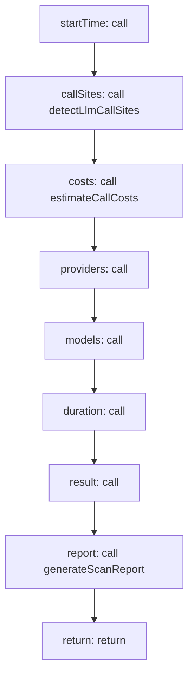

<!-- @generated by flusk-lang — DO NOT EDIT -->

# scanCodebase

> Static analysis to find all LLM call sites in a project

## Inputs

| Parameter | Type | Required |
|-----------|------|----------|
| projectPath | string | yes |
| scanType | string | yes |

## Steps

## Output

Type: `CodeScanResult`
