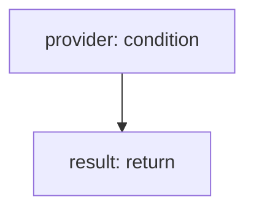

<!-- @generated by flusk-lang — DO NOT EDIT -->

# sendToProvider

> Send an alert to a specific provider based on channel type

## Inputs

| Parameter | Type | Required |
|-----------|------|----------|
| channel | AlertChannel | yes |
| alert | AlertEvent | yes |

## Steps

## Output

Type: `boolean`

## Error Handling

- **ProviderError**: log-and-return-false
