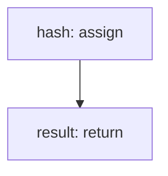

<!-- @generated by flusk-lang — DO NOT EDIT -->

# sha256

> Compute SHA-256 hash of input string

## Inputs

| Parameter | Type | Required |
|-----------|------|----------|
| input | string | yes |

## Steps

## Output

Type: `string`
