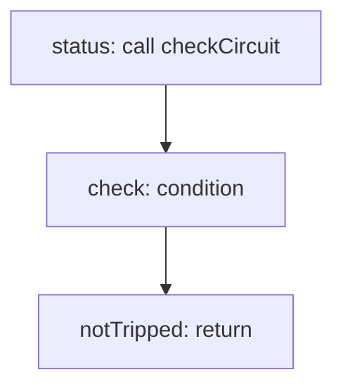

<!-- @generated by flusk-lang — DO NOT EDIT -->

# shouldAutoPause

> Determine if agent should be auto-paused based on circuit breaker

## Inputs

| Parameter | Type | Required |
|-----------|------|----------|
| db | Database | yes |
| config | CircuitBreakerConfig | yes |

## Steps

## Output

Type: `boolean`
