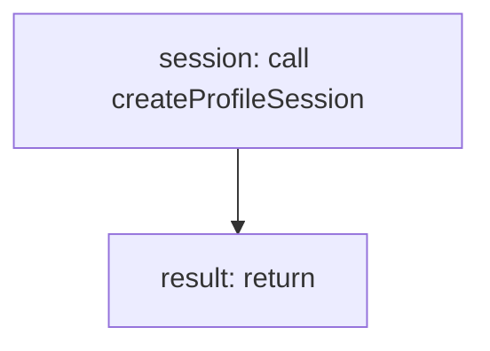

<!-- @generated by flusk-lang — DO NOT EDIT -->

# startProfile

> Start a CPU/heap profile session

## Inputs

| Parameter | Type | Required |
|-----------|------|----------|
| db | Database | yes |
| profileType | enum | yes |
| pid | integer | yes |
| name | string | yes |

## Steps

## Output

Type: `ProfileSession`
