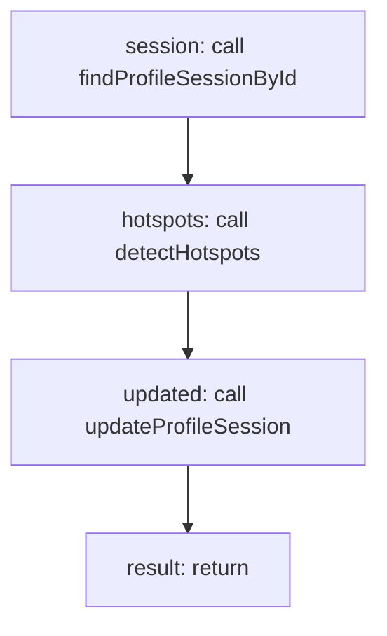

<!-- @generated by flusk-lang — DO NOT EDIT -->

# stopProfile

> Stop profiling, save results, and detect hotspots

## Inputs

| Parameter | Type | Required |
|-----------|------|----------|
| db | Database | yes |
| sessionId | string | yes |

## Steps

## Output

Type: `ProfileSession`
