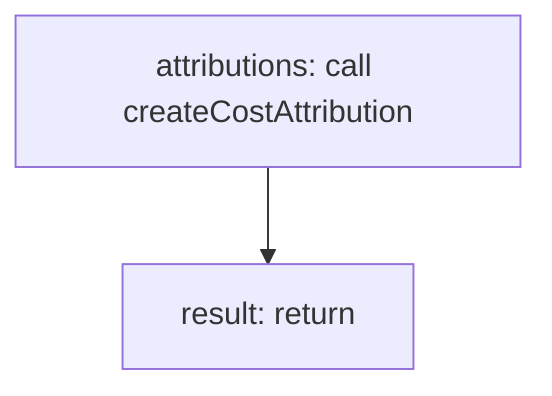

<!-- @generated by flusk-lang — DO NOT EDIT -->

# tagLlmCall

> Attribute an LLM call to one or more cost tags (feature, team, customer)

## Inputs

| Parameter | Type | Required |
|-----------|------|----------|
| llmCallId | string | yes |
| tags | json | yes |
| costUsd | number | yes |
| inputTokens | number | yes |
| outputTokens | number | yes |
| model | string | yes |
| provider | string | yes |
| db | Database | yes |

## Steps

## Output

Type: `CostAttribution[]`
