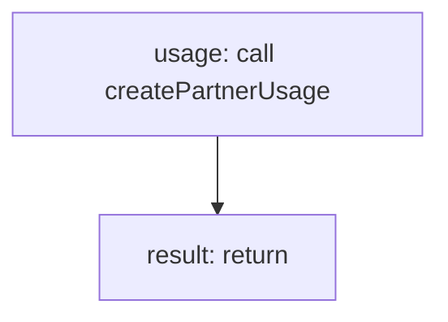

<!-- @generated by flusk-lang — DO NOT EDIT -->

# trackPartnerUsage

> Records usage data for a partner integration

## Inputs

| Parameter | Type | Required |
|-----------|------|----------|
| partnerId | string | yes |
| integrationId | string | yes |
| calls | number | yes |
| cost | number | yes |
| errors | number | yes |
| db | Database | yes |

## Steps

## Output

Type: `PartnerUsage`
