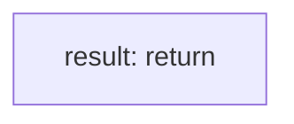

<!-- @generated by flusk-lang — DO NOT EDIT -->

# trackProviderOutcome

> Record outcome of a provider call for health tracking

## Inputs

| Parameter | Type | Required |
|-----------|------|----------|
| provider | string | yes |
| model | string | yes |
| latencyMs | number | yes |
| success | boolean | yes |
| statusCode | number | yes |

## Steps

## Output

Type: `void`
