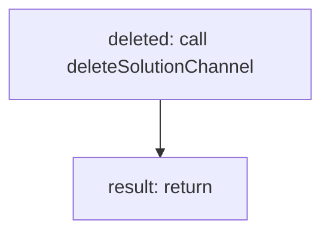

<!-- @generated by flusk-lang — DO NOT EDIT -->

# unpublishFromChannel

> Disconnects a solution from a messaging channel

## Inputs

| Parameter | Type | Required |
|-----------|------|----------|
| channelId | string | yes |
| db | Database | yes |

## Steps

## Output

Type: `boolean`
