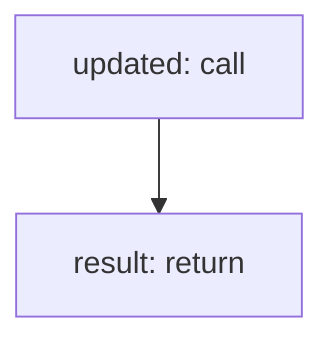

<!-- @generated by flusk-lang — DO NOT EDIT -->

# updateApiKeyLastUsed

> Update the lastUsedAt timestamp on an API key

## Inputs

| Parameter | Type | Required |
|-----------|------|----------|
| apiKeyId | uuid | yes |

## Steps

## Output

Type: `json`
