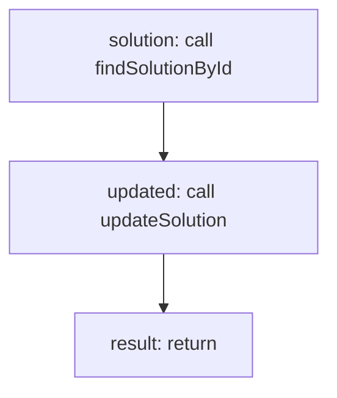

<!-- @generated by flusk-lang — DO NOT EDIT -->

# updateSolutionMetrics

> Update solution metrics after a run completes

## Inputs

| Parameter | Type | Required |
|-----------|------|----------|
| solutionId | string | yes |
| cost | number | yes |
| durationMs | number | yes |
| db | Database | yes |

## Steps

## Output

Type: `json`
