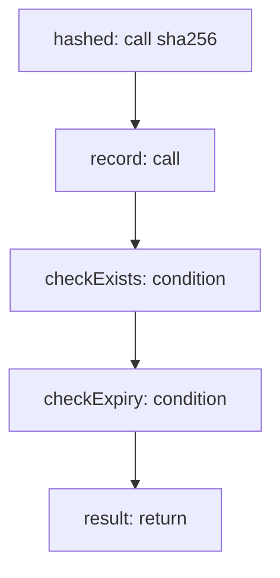

<!-- @generated by flusk-lang — DO NOT EDIT -->

# validateApiKey

> Hash the raw key, look up by hash, check expiry/status/scopes

## Inputs

| Parameter | Type | Required |
|-----------|------|----------|
| rawKey | string | yes |
| requiredScope | string | yes |

## Steps

## Output

Type: `json`
